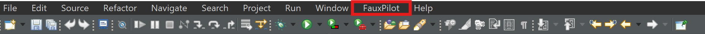

# Copilot Alternative for Proprietary Applications
This is an Eclipse IDE plugin that aims to provide similar functionaliy to GitHub Copilot but without the need to be constantly connected to the internet. Instead, you can connect to a self hosted solution. 

## Currently Supported Backends
- Fauxpilot
- Tabby

# Installation
[Download the extension](https://github.com/Capstone-CSCE-TAMU-2024-Fall/capstone-l3harris-co-pilot-for-proprietary-apps/releases/latest/)

1. Open Eclipse
2. Click Help -> Install New Software...
3. Click Add...
4. Click Archive...
5. Select the zip file containing the plugin and click add
6. From the dropdown, select the zip file that was just added
7. Uncheck Group items by category
8. Check CopilotAssistant
9. Click Next, then Finish
10. Click Select All when asked about trusting unsigned content and click Trust Selected
11. Restart the IDE

# User Guide

## Overall Usage
The general functionality of this extension is to provide code suggestions from a locally hosted model in the form of ghost text that the user can accept or deny. When a code suggestion appears, the user can hit the **tab** key to accept the code suggestion in its entirety and add the text to your file. In order to deny the code suggestion the user can either overwrite the suggestion by continuing typing or hit the **esc** key.

## Preference Menu
To access the user menu the user can look at the top tool bar and select the Coding Assistant drop down and choose "Open Preferences"

The following image will then appear on the screen:

**Server Host**: Will contain the host address that your model is running on

**Server Port**: Will contain the port that your model is running on

**Select Engine**: Select what backend you are using (currently FauxPilot or Tabby)

**Protocol**: Select if you want to use HTTP or HTTPS calls (Likely depends of server setup)

**Max Tokens**: Limits the number of tokens in the response from the server

**Temperature**: Sets the randomness of the code suggestions. (0.1 or 0.2 is recommended)

**Suggestion Delay**: The amount of time between stopping typing and the code suggestion being requested. (Time in milliseconds)

**Enable Code Insertion**: Turn on/off code suggestions

## Enable Code Suggestion Toggle

In the bottom right corner of the screen there will be a toggle that will turn on or off the extension. When to the left it is off. When to the right and blue it is on.

Off:

On:

# Uninstall
- Click on Help -> Search "About Eclipse" (on some versions, it may be Eclipse IDE or Eclipse).
- Click Installation Details.
- In the Installed Software tab, find and select CopilotAssistant.
- Click Uninstall at the bottom of the window.
- Follow the prompts to complete the uninstallation.
- Restart Eclipse to fully remove the plugin.

# Documentation

https://github.com/orgs/Capstone-CSCE-TAMU-2024-Fall/projects/1 

# Building & Development

## Project Environment
- Source Control
    - Git
- Development Environment
    - Eclipse PDE
- Language Version
    - Java 21

## Installation

Install Eclipse PDE

Install Java >= 21

Clone this Github repository

## Execute Code

1. Open up the project in the Eclipse PDE
2. Click Run
3. A new Eclipse window will launch with the plugin installed

## Tests

1. Open up the [codingassistant](com.codingassistant.codingassistantplugin) plugin project in Eclipse
2. Navigate to [codingassistant.target](com.codingassistant.codingassistantplugin/codingassistant.target)
3. Click Start Target or Reload Target, which is in the upper right corner
4. Open the [codingassistanttests](com.codingassistant.codingassistanttests) plugin project
4. Navigate to a file to test and click Debug As -> JUnit Test or JUnit Plugin Test

## Deployment
1. Right click on the [codingassistant](com.codingassistant.codingAssistant) feature project and click Export...
2. Select Plug-in Development -> Deployable features and click Next
3. Select the Archive file option
4. Click Finish

# Documentation

For more detailed documentation, please refer to the [Documentation Index](com.plugin.copilotassistant/doc/index.html).

# Contributing
For more detailed information about how to contribute, take a look at [CONTRIBUTING.md](CONTRIBUTING.md).

# Our Team

- Ryan Pavlik
- Blake Avery
- David Zhao
- Vincent Tran
- Haodong Lao

# Credits
Capstone instructors: Brady Testa and Jeffrey Hykin

Sponsors from L3Harris: Dwight Horne, Kayla Hunt

The Tabby Eclipse plugin's code for rendering text was used in the [TextRenderer](/com.codingassistant.codingassistantplugin/src/com/codingassistant/codingassistant/TextRenderer.java) class. We really appreciate it being open source.
https://github.com/TabbyML/tabby/tree/main/clients/eclipse